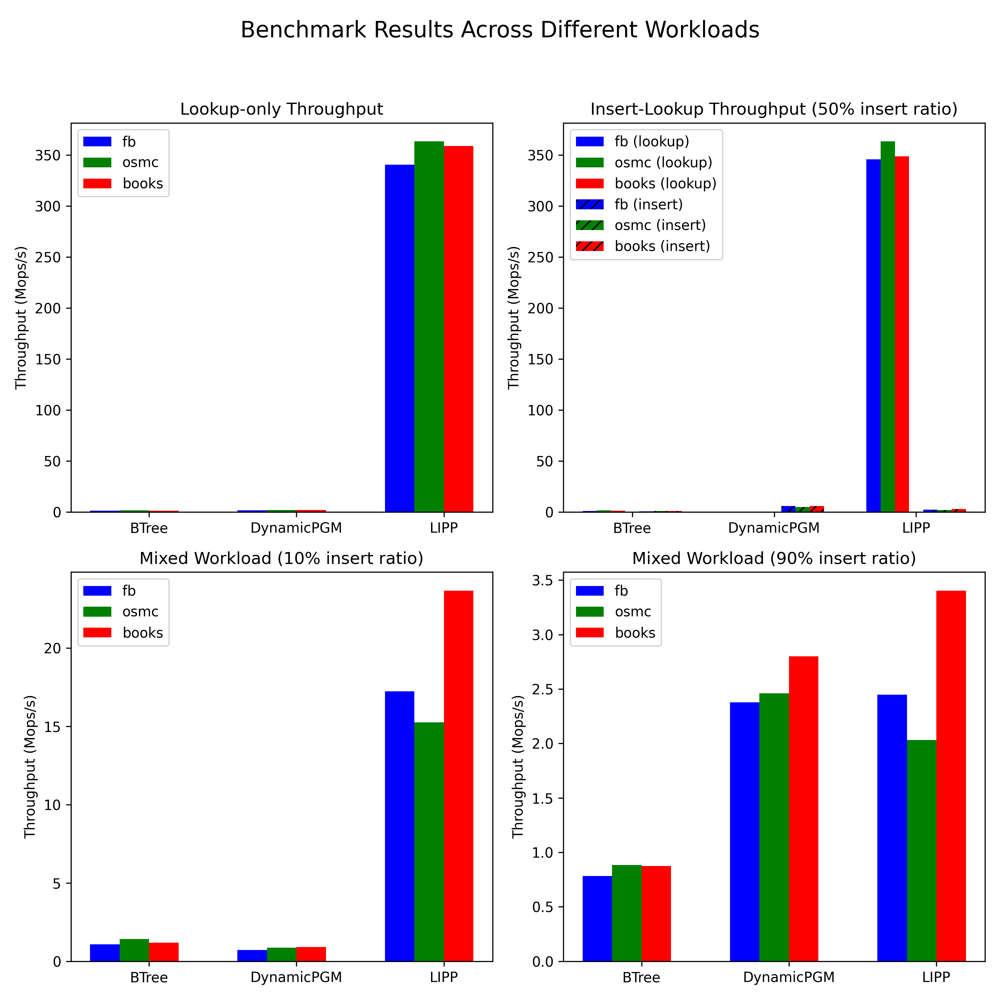

## Task 1 writeup 

Mike Neuder, COS 568 Project, Spring 2026

---

The only slurm parameter I had to configure was making sure there was sufficient memory for the task. I used 

```
#SBATCH --mem=128G
```

The plot below shows the results (with the legend fixed) from the provided `analysis.py` file. 



I chose to plot each independently to make sense of the results. The following discussion goes through each in order.


### Lookup-only

In the lookup only experiment, we see that LIPP is dominant.


- Across all three datasets, LIPP maintains a nearly `350 Mops/s` throughput, which dominates the approximatly `1.4 Mops/s` of Btree and `1.7 Mops/s` of DynamicPGM. 
- The BTree and DPGM hyperparameters that are best use the largest linear search that is configured (8 and 16) respectively. Since the benchmark is only lookups, having larger contiguous levels makes for fewer pointer chasing events, which helps ensure that the memory containing the data is reached in fewer hops. 
- LIPP is so dominant because it is highly tuned to predict the lookup location accurately at the cost of insertion speed and construction of the index. As such, this benchmark is setup perfectly for LIPP to be successful, where its O(1) lookup time is on full display. Because BTree and DPGM will always have to hop through some layers of the data structure, their performance is much worse.

### Insert-Lookup 

In the insert-lookup experiment, we have 1m insertion operations followed by 1m lookup operations. As such, we can measure the performance of each of these separately. First we look at the insert performance.


- Here, we see that DPGM is over 2-3x faster than LIPP and about 6x faster than BTree. 
- Interestingly BTree still makes use of the largest linear search configuration across all data set, but DPGM uses three different configurations for the different data sets. In particular, DPGM uses very large error bounds of 256, 1024, and 512 respectively, which makes sense, because larger bounds mean more inserts can happen before a restructuring event.
- LIPP still performs quite well, but it has to pay the cost of maintaining the complex learned index, which results in the lower throughput. Recall that this part of the benchmark is *just* inserts, no lookups yet. 

Now, the lookup performance.


- Here, again, LIPP dominates in the lookup only portion of the benchmark and returns to the immense improvement over the other two methods. The analysis for this is the largely the same as for the lookup only benchmark earlier. 
- One difference is that DPGM used large error bounds (to help with insertion speed), resulting in a significantly worse lookup throughput than before (0.4 Mops/s vs. 1.7 Mops/s on the lookup only task). 
- The BTree largely performs the same as it did in the lookup only task (about 1.3 Mops/s in both), because it uses the same parameter configuration. 
- Note that, for DynamicPGM, the optimized parameters for the Insert are different than the optimized parameters for the Lookup. Because we are taking the max over the performance of each subtask, this is actually an upper-bound on the throughput of DPGM. A more fair comparison would have to choose a parameter configuration and stick with it for both the insert and lookup portion of the benchmark. But since LIPP is so dominant anyway, that wouldn't qualitatively change the takeaways from the experiment.


### Mixed workload 10%

In this workload, the inserts and lookups are mixed with only 10% of the operations being inserts. The plot below shows the throughput for the different methods.


- With such a high proportion of lookups to inserts, LIPP continues to be extremely dominant, averaging around 19 Mops/s whereas BTree does about 1.2 and DPGM does about 0.88. 
- It is notable that BTree outperforms DPGM, but it shows how much DPGM is configured to be good at handling inserts specifically, and the 10% ratio is too small to see those benefits. 
- Also, the DPGM uses more moderate error bounds of 128, 128, and 32, which sit between the ultra small values which are good for lookups and the large values that are optimized for inserts.


### Mixed workload 90%

In this workload, the inserts and lookups are mixed, but now with 90% of the operations being inserts. The plot below shows the throughput for the different methods.


- Now, DPGM gets to see some of the benefits of having a large portion of the mixed workload be inserts rather than lookups. This results in DPGM having the best average performance with about 2.5 Mops/s, compared to the 0.86 of BTree and 2.3 of LIPP. 
- Again, DPGM uses more moderate values for the error bounds to balance insert and lookup speed. While DPGM does perform the best in this experiment, it is only marginally better than LIPP, showing how well rounded LIPP is with its very fast processing of lookups. Even when only 10% of the operations are lookups, it is so much faster in that portion of the task that it makes up for the slowness of the inserts.
